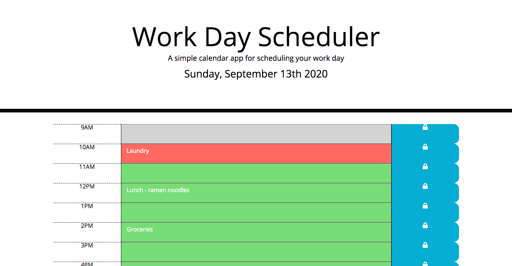

# workday-scheduler-app

## Objective 
create an interactive scheduler that allows users to store their input for their business day hours. 

## Usage
This way users can view their current day todo-list/schedule and make adjustments as they go. The scheduler will display the current hour in red and have gray/red colors for past/future. 

## Screenshots 

## Link

- [GitHub Page](https://codybonsma.github.io/workday-scheduler-app/)

## 